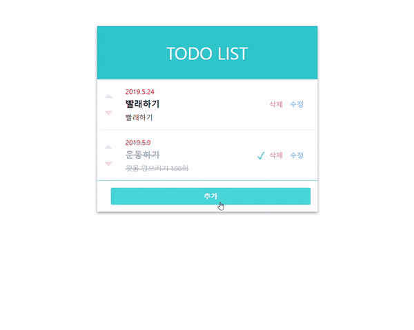

# TodoList

> 프론트앤드: React.js
>
> 백앤드: Node.js
>
> DB: MongoDB

### 요구사항

* 기능 요구사항
  * 새로운 TODO(제목과 내용)를 작성할 수 있다.
  * TODO 목록을 볼 수 있다.
  * TODO 항목의 제목과 내용을 수정할 수 있다.
  * TODO 항목을 삭제할 수 있다.
  * 사용자의 선택에 의해 TODO에는 마감 기한을 넣을 수 있다.
  * TODO 항목의 우선순위를 설정 및 조절할 수 있다.
  * TODO 항목에 대한 완료 처리를 할 수 있다.
  * 마감기한이 지난 TODO에 대해 알림을 노출할 수 있다.
* 성능 요구사항
  * TODO 이용 시 발생하는 오류 사항을 최소화한다.
  * 오류 발생 시 사용자가 이해하기 쉽게 표시한다.
  * 다른 사람이 읽기 쉬운 코드를 작성한다.
  * HTML/CSS에서 사용할 수 있는 최신 구조와 기술을 사용한다.
* 인터페이스 요구사항
  * 직관적이고 의미 전달이 명확한 화면을 사용자에게 제공한다.


### 프론트앤드

#### 실행

```shell
$npm install
$npm start
```

#### 빌드

```shell
$npm run build
```


### 백앤드

> 먼저 mongoDB를 실행시켜야 한다. `mongodb://localhost:27017`

#### 실행

```shell
$npm install
$npm start
```


### RESULT

